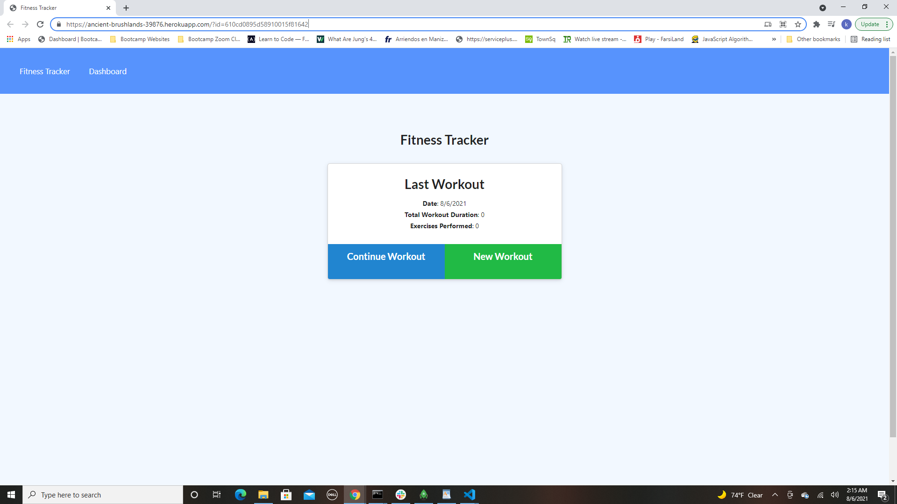
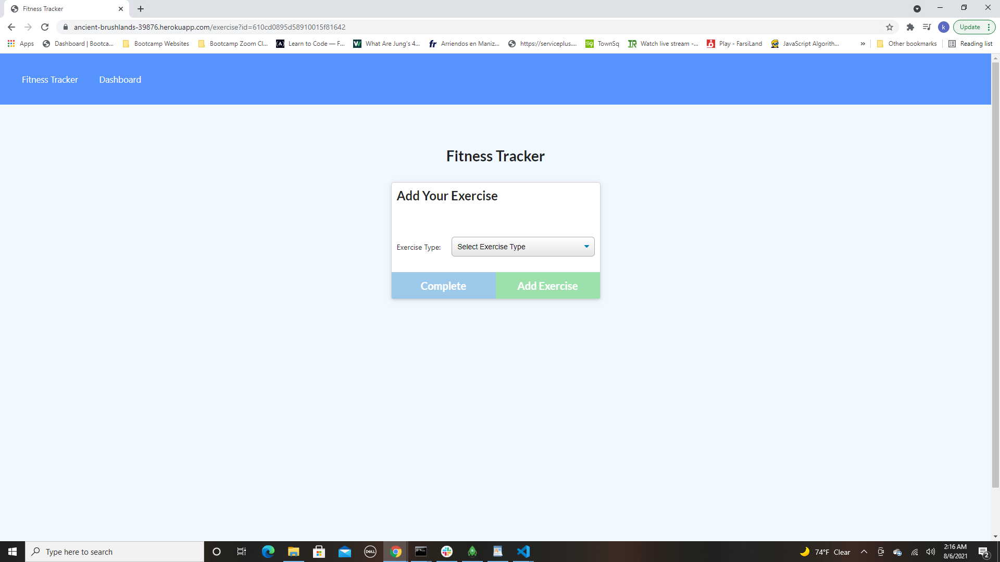
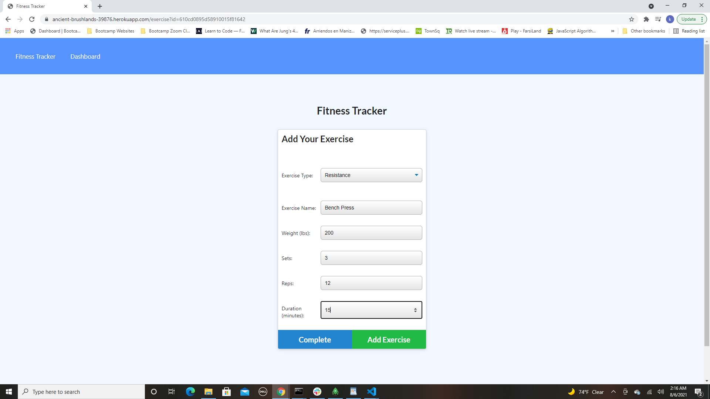
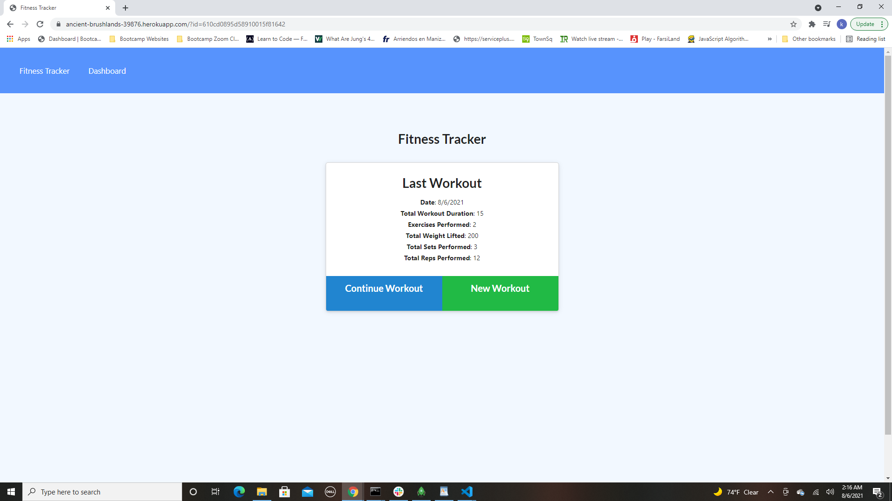
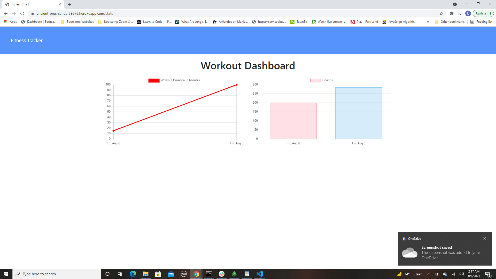
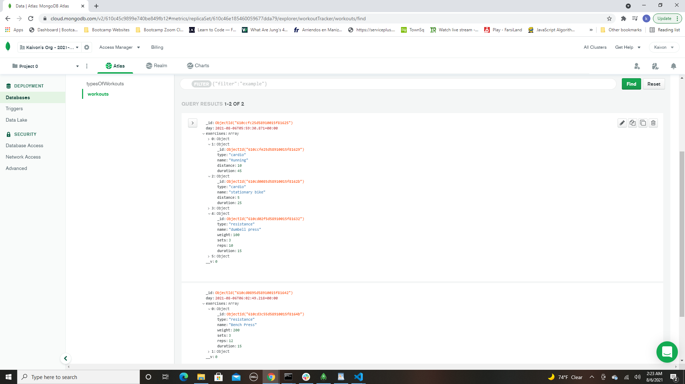

# Fitness-Tracker

Visit the Deployed Site offered by Heroku:  

 https://ancient-brushlands-39876.herokuapp.com/

# Description

This app is a great way to track your fitness! User can talor their workouts and have them all scheduled out so that it makes working out even easier. This also keeps track of the stats and what has been accomplished daily so that you can keep yourself honest! 

# Installation 

NPM I 

# How to Use

User can visit the website using the url above and start adding exercises! It is that easy! 

# Technology Used

 - Node.js
 - Mongoose 
 - JavaScript
 - Heroku 
 - Express

# Contact

Any questions or concerns about this app, please contact me:

Github: https://github.com/kaivont85
Email: kaivont@gmail.com

## Application

